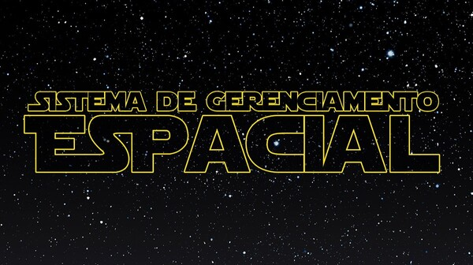

---

Programa desenvolvido em Python que consulta e gerencia informações de personagens do universo Star Wars, utilizando a API [SWAPI](https://swapi.info/).

## Execução

Ao executar o programa (`sistema/main.py`), um menu interativo é apresentado:

1. **Buscar pessoa por nome**

   Consulta um personagem pelo nome completo e exibe suas características.

2. **Buscar pessoas por planeta natal**

   Lista os personagens associados ao planeta informado.

3. **Buscar pessoas por prefixo do nome**

   Localiza nomes de personagens com determinado prefixo.

4. **Transmitir informações planetárias**

   Converte as informações dos planetas em texto, aplica compressão utilizando o algoritmo de Huffman e exibe a mensagem codificada, tabela de frequências, árvores de Huffman (pós-ordem e ordem simétrica), códigos binários e taxa de compressão.

5. **Sair**

   Encerra o programa.

## Estruturas e algoritmos utilizados

### Árvore Trie

Os nomes dos personagens são armazenados em uma árvore Trie (`sistema/estruturas/trie.py`). Essa estrutura permite:

- Buscar personagem por nome completo
- Pesquisar nomes por prefixo
- Realizar buscas sem diferenciar letras maiúsculas e minúsculas
- Preservar a forma original dos nomes exibidos
- Demonstrar a quantidade de nós que a estrutura percorre em cada ação

**OBS:** Cada nó da Trie possui um vetor com 256 posições para representar caracteres ASCII, evitando o uso de `dict`.

### Codificação de Huffman

Através do algoritmo de Huffman (`sistema/estruturas/huffman.py`), foi possível:

- Contar a frequência dos caracteres
- Construir a árvore usando uma fila de prioridade
- Gerar os códigos binários
- Codificar a mensagem
- Calcular a taxa de compressão

## Endpoints da API

O sistema utilizou os seguintes endpoints:

- `/people/`  (informações dos personagens)
- `/planets/` (informações dos planetas)
- `/films/` (informações dos filmes)
- `/vehicles/`  (informações dos veículos)
- `/starships/` (informações das naves)

## Créditos

Repositório criado em conjunto por [Eduardo Ramos](https://github.com/eduardoOTR), [Felipe Ferreira](https://github.com/FelipeAndriFe) e [Rafael Bermudes](https://github.com/RafaelLBermudes).

Este projeto utiliza dados fornecidos pela [Star Wars API: SWAPI](https://swapi.info/), disponibilizados sob a [Licença MIT](https://mit-license.org/).

*Star Wars* e seus personagens, nomes e elementos associados são propriedade de seus respectivos titulares.

### Que a Força esteja com você!
